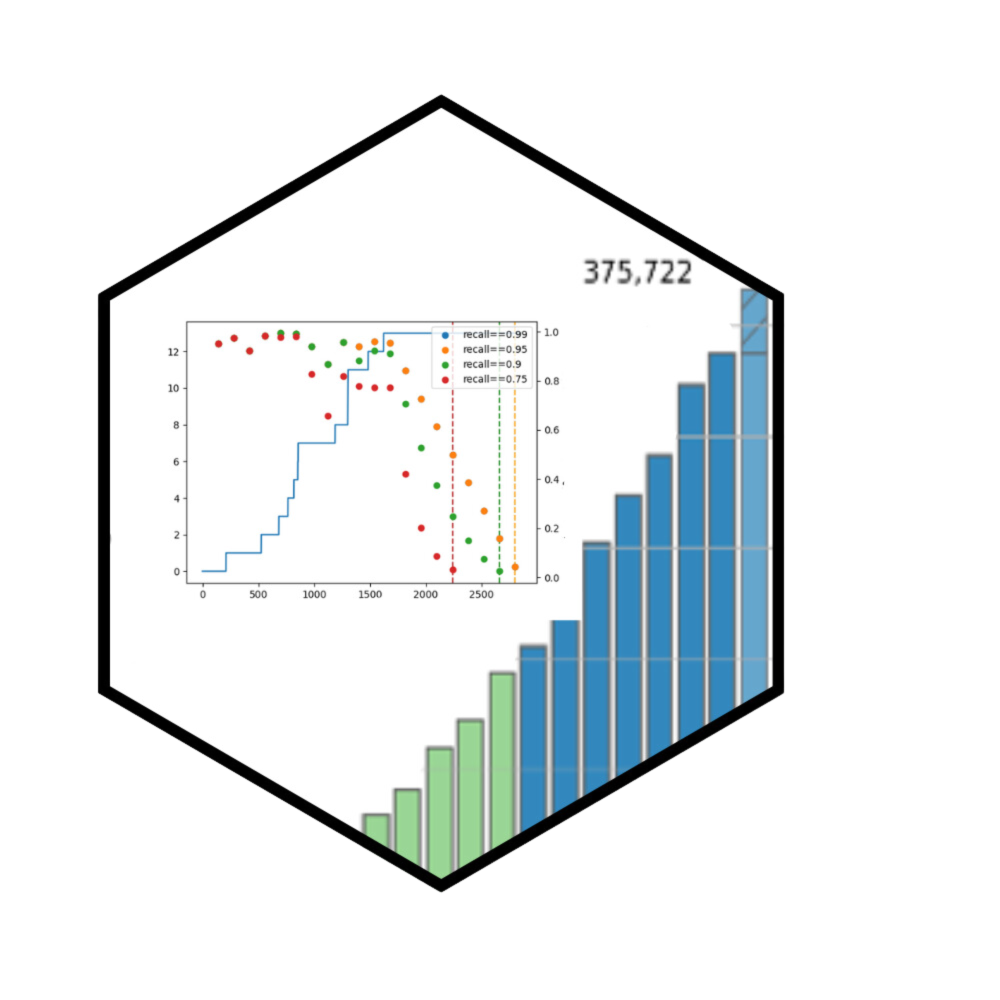

# Stopping methods for priority screening

<div float="left">
    
    <p>
        Priority screening has gained popularity across all major systematic review tools.
        This process uses machine learning to rank all remaining unseen documents by their relevance.
        To fully benefit from the prioritisation, users need to know when it is safe to stop screening.
    </p>
</div>

We define stopping methods 'safe to stop' as:
* a way to determine when a pre-defined recall is met
* a way to quantify certainty

For information how to execute the framework, check [`simulation/README.md`](simulation/README.md)

## Vision
With this project, we aim to consolidate all available stopping methods and evaluation datasets into a single repository.
We also define a standardised format to execute stopping methods in order to run rigorous evaluation.
This will allow us to compare characteristics of each method to inform guidelines on how to safely use them.

We envision this project to define an interchangeable format to allow users of digital evidence synthesis tools to use all available stopping methods in their particular review.
Further, developers of stopping criteria should adapt this format.

In the future, we hope to share evaluations for all datasets and all stopping methods on a website.

## Project structure
* Datasets: Scripts to retrieve datasets for evaluation
* Stopping methods: Implementations or adapters to run a stopping criterion
* Evaluation framework: Scripts to run simulations

## Example usage
Here is an example on how you can use the implemented stopping methods in your own project.
Simply import the method(s) you'd like to use and apply them.
When the `safe_to_stop` entry of the returned result is `True`, the stopping criterion is met.

```python
from methods.buscar import Buscar

stopping_result = Buscar.compute(
    # Absolute size of our dataset (seen and unseen)
    dataset_size=15,

    # Inclusion decisions for the 10 records we already screened (0: exclude, 1: include)
    list_of_labels=[0, 0, 1, 1, 0, 1, 0, 0, 1, 0],

    # Ranking model scores for *all* records
    # Not all scores use this information, so might be optional
    #                    | seen: sorted by screening order                       | unseen: sorted by score   |
    list_of_model_scores=[0.4, 0.59, 0.48, 0.57, 0.5, 0.45, 0.36, 0.35, 0.32, 0.3, 0.25, 0.2, 0.19, 0.18, 0.1],

    # First five are from initial random sample, rest is prioritised
    # Not all scores use this information, so might be optional
    is_prioritised=[False, False, False, False, False, True, True, True, True, True],

    # Method-specific parameters
    recall_target=0.95,
    bias=1,
    confidence_level=0.95,
)
print(f'Reached stopping criterion: {stopping_result.safe_to_stop}')
print(stopping_result)
```

Note, that some methods might change the decision later.
What really counts is the first time the method wants to stop.

The following might not be relevant when you repeatedly execute the code as more labels come in.
For a retrospective analysis, use the dedicated function that loops over batches.

```python
from methods.buscar import Buscar

for batch_result in Buscar.retrospective(batch_size=10, dataset_size=...):
    print(f'Reached stopping criterion: {batch_result.safe_to_stop}')
    print(batch_result)
    if batch_result.safe_to_stop:
        break
```

For information how to execute the entire framework, check [`simulation/README.md`](simulation/README.md)

## Datasets
|    | Reference | Research area | Number of records | Number includes | Data URL                                                                                                     | Publicly available | 
|---:|:---------:|--------------:|------------------:|----------------:|--------------------------------------------------------------------------------------------------------------|--------------------|

## Evaluation framework
Degrees of freedom to validate
* ML Model characteristics
* Size of initial random sample
* Criterion-specific recall/confidence targets
* Training regime
* Ranking model hyperparameter tuning

```
for each repitition
  for each ML model type
    for each initial random sample size
      for each dataset
        for each batch in dataset ¹ ²
          train model of previsously seen data³
          -> from all models, pick best one (max F1) at this stage

          rank unseen data
          for each stopping criterion
            for each stopping criterion sub-config (e.g. recall target)
              computer stopping value
        compute performance metrics (precision, recall, includes missed, work saved, ...)

¹ until all criteria stop?
² adaptive batch size, e.g. growing with the number of seen records or number of includes per batch
³ including hyper-parameter tuning on a subset
```

## Additional resources
* "Cohen dataset": https://dmice.ohsu.edu/cohenaa/systematic-drug-class-review-data.html
* Dataset beyond the Cohen et al data linked to OpenAlex and enriched: https://github.com/asreview/synergy-dataset
* SYNERGY Dataset with added inclusion criteria: https://github.com/VeenDuco/inclusion_exclusion_priors
* Collection of many existing dataset collections https://github.com/WojciechKusa/systematic-review-datasets
* Rapid screening project: https://github.com/mcallaghan/rapid-screening/
* Simplified buscar score web app: https://github.com/mcallaghan/buscar-app
* LLMs for prioritisation: https://github.com/mcallaghan/ml-screening-evaluation
* buscar in R and python: https://github.com/mcallaghan/buscarR / https://github.com/mcallaghan/buscarpy

## Contributors
This repository was started at the [Evidence Synthesis Hackathons 2024](https://www.eshackathon.org/) by
* Lena Schmidt (NIHR)
* Francesca Tinsdeall (University of Edinburgh)
* Sergio Graziosi (EPPI@UCL)
* James Thomas (EPPI@UCL)
* Diana Danilenko (PIK)
* Tim Repke (PIK)
